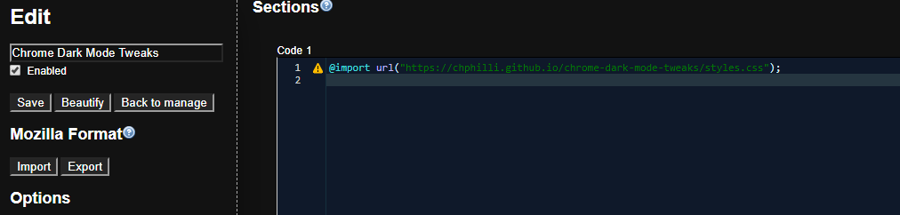

# chrome-dark-mode-tweaks

Provides simple hosting of css tweaks to Chrome's Dark Mode experimental features. 

# Setup

1. Install the Stylish extension.
2. Add a new style, with the following content: 

    `@import url("https://chphilli.github.io/chrome-dark-mode-tweaks/styles.css");`

At this point, your style in Stylish should look something like this:

If so, you're done! You should now have the tweaks being applied. You can add & test additional styling in the Stylish configuration and commit back to the tweaks later when you're satisfied with them. 

Note that browsers cache this content aggressively, so you may need to force a reload of the browser cache to see updates. 
